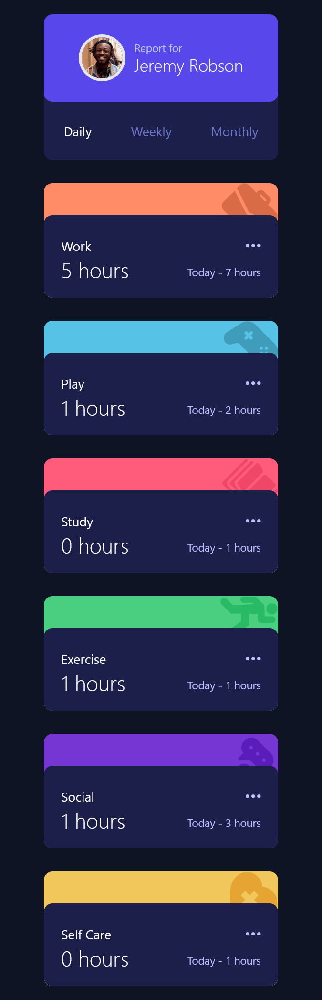
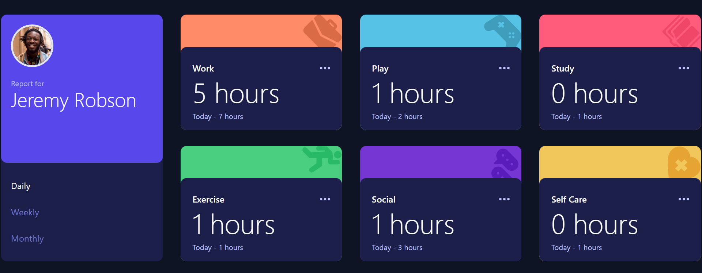

# Frontend Mentor - Single-page design portfolio solution

This is a solution to the [Time tracking dashboard challenge on Frontend Mentor](https://www.frontendmentor.io/challenges/time-tracking-dashboard-UIQ7167Jw). Frontend Mentor challenges help you improve your coding skills by building realistic projects.

## Table of contents

- [The challenge](#the-challenge)
- [Screenshots](#screenshots)
- [Links](#links)
- [Built with](#built-with)
- [What I learned](#what-i-learned)
- [Author](#author)

### The challenge

Users should be able to:

- View the optimal layout for the site depending on their device's screen size
- See hover states for all interactive elements on the page
- Switch between viewing Daily, Weekly, and Monthly stats

### Screenshots

### Links

- Solution URL: [Time Tracking Dashboard](https://github.com/sonny-coding/time-tracking-dashboard)
- Live Site URL: [Vercel](https://time-tracking-dashboard-delta-one.vercel.app/)

### Built with

- Mobile-first workflow
- Vite
- Tailwindcss

### What I learned

- More CSS Grid practice

### Author

- Github - [sonny-coding](https://github.com/sonny-coding)
- Twitter - [@sonnyConnect](https://twitter.com/sonnyConnect)
